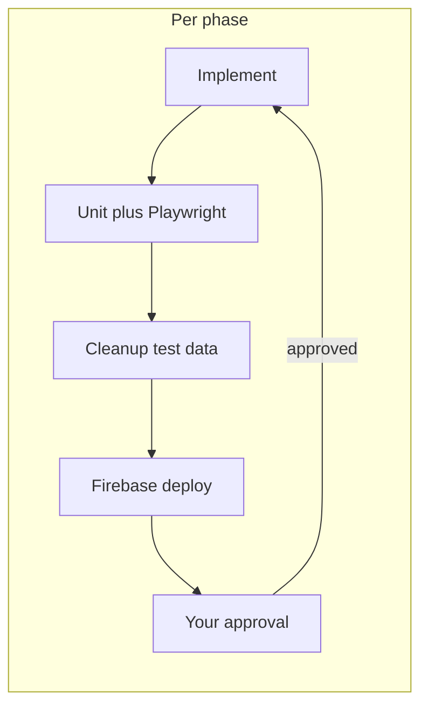
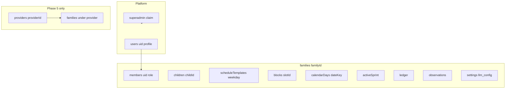

# Phased SaaS rollout (family-first, gated deploys)

## How each phase ends (your gate)

Every phase follows the same **Definition of Done** before you are asked to approve the next phase:

1. **Implement** scope only for that phase (no sneak-ahead features).
2. **Test locally** against Firebase emulators (Auth `:9099`, Firestore `:8080`, Hosting `:5000`; add Functions `:5001` when APIs change).
3. **E2E**: seed deterministic test family data → run `npm test` → **cleanup** test users/families (scripted; no leftover emulator pollution).
4. **Deploy** to project `homeschooling-b3e57`: hosting + `firestore.rules` + `firestore.indexes.json` + functions when touched.
5. **Stop** and request your consent to start the next phase (no parallel phase work).



**Your choices (locked in):** Email + Google sign-in in Phase 1; production may be **fresh re-seed** under `families/{familyId}` (root-level `crew`, `schedule`, etc. are retired, not migrated).

---

## Target end-state (reference architecture)



User-facing language: **Family** everywhere for B2C. Code uses `familyId` (not “organization” in UI).

---

## Phase 1 — Auth, family tenant, secure rules (foundation)

**Goal:** A parent can sign up (email or Google), land in a warm **family** onboarding, and use the app with all data under `families/{familyId}/…`. No provider mode yet. Root operational collections are **removed from client writes**.

### Deliverables

| Area | Work |
|------|------|
| Auth UI | New [`public/login.html`](public/login.html) + [`public/onboarding.html`](public/onboarding.html) (family name optional, timezone, add children or skip). |
| SDK | Extend [`public/firebase-init.js`](public/firebase-init.js): `getAuth`, `connectAuthEmulator` when `USING_EMULATOR`, session `familyId` after onboarding. |
| Data paths | Introduce [`public/db-paths.js`](public/db-paths.js) (or `family-context.js`): single API `familyRef(familyId, …)` so pages stop hard-coding `doc(db, "schedule", day)`. |
| Bootstrap | Refactor [`public/bootstrap.js`](public/bootstrap.js): `seedFamilyDefaults(db, familyId)` writes children, templates, sprint, skills copy — **not** root `crew` / `schedule`. |
| Pages | Update [`public/index.html`](public/index.html), [`public/admin.html`](public/admin.html), [`public/settings.html`](public/settings.html), [`public/roadmap.html`](public/roadmap.html), [`public/children.html`](public/children.html): require auth; redirect unauthenticated users to login; all reads/writes scoped by `familyId`. |
| Rules | Rewrite [`firestore.rules`](firestore.rules): deny root legacy paths for clients; allow `families/{familyId}/**` only if `request.auth` is in `families/{familyId}/members/{uid}` with role `owner` or `parent` (start with those two). |
| Users doc | `users/{uid}`: `defaultFamilyId`, `displayName`, `email`. |
| Functions | Pass `familyId` on API calls (header or body); verify membership in [`functions/index.js`](functions/index.js), [`functions/schedule-ai.js`](functions/schedule-ai.js), [`functions/troubleshoot.js`](functions/troubleshoot.js). Admin SDK reads/writes under `families/{familyId}/…`. |
| Hosting | Redirect `/` → login if no session; post-login → player or admin based on role (parents → admin optional default). |
| Prod cutover | Document one-time: deploy rules + hosting; **discard** old root data; first real signup runs family seed. |

**Intentionally unchanged in Phase 1:** Schedule still one doc per weekday with embedded `blocks[]` (minimizes churn while securing tenancy). Provider accounts, superadmin UI, `calendarDays`, block subcollections.

### Testing (Phase 1)

- Add [`tests/e2e/auth.setup.js`](tests/e2e/auth.setup.js): create Auth emulator user + family via Admin SDK or emulator REST; store storage state for Playwright.
- Update [`playwright.config.js`](playwright.config.js): start **auth** emulator; `globalSetup` / `globalTeardown` for seed + cleanup.
- New specs: `auth-onboarding.spec.js`, `family-isolation.spec.js` (second family cannot read first — rules smoke).
- Refactor [`tests/e2e/helpers.js`](tests/e2e/helpers.js): `signInAsTestParent(page)` before `waitForAdminReady` / `waitForPlayerReady`.
- Add npm scripts: `test:e2e:seed`, `test:e2e:cleanup` (Node script using `firebase-admin` against emulators).
- Keep existing [`tests/e2e/admin.spec.js`](tests/e2e/admin.spec.js) and [`tests/e2e/player-troubleshoot.spec.js`](tests/e2e/player-troubleshoot.spec.js) green after auth wrapper.

### Deploy (Phase 1)

```bash
firebase deploy --only hosting,firestore:rules,firestore:indexes
firebase deploy --only functions
```

Post-deploy: you complete one real family signup on production (fresh seed). Confirm player + admin connect.

**Gate:** You confirm login, onboarding feels like “welcome to your family,” and existing E2E suite passes on emulators → approve Phase 2.

---

## Phase 2 — Schedule shape + faster loads (no new product surfaces)

**Goal:** Fix scalability/read latency inside a family without changing user-facing concepts (still Mon–Fri templates).

### Deliverables

| Area | Work |
|------|------|
| Schema | `families/{familyId}/scheduleTemplates/{weekday}` — metadata + optional `slotsSummary[]` (title, start, end, slot, payout). |
| Blocks | `families/{familyId}/scheduleTemplates/{weekday}/blocks/{slotId}` — full block payload (children, passages, guides). |
| Clients | Admin: load summary first → fetch single block on activity click. Player: subscribe only to **active weekday** + active block doc. |
| Bootstrap | Seed writes subcollection docs; remove giant single-doc `blocks` array. |
| Rules | Rules for `blocks/{slotId}` match parent roles. |
| Indexes | Update [`firestore.indexes.json`](firestore.indexes.json) if any collectionGroup queries added. |
| Boot perf | Do not `await` heavy `syncBuiltinDefaults` before first paint; run in background with `families/{familyId}/meta.syncVersion`. |

### Testing (Phase 2)

- E2E: calendar list shows titles before detail panel hydrates; select activity → detail appears.
- Performance smoke: assert `#activityList .activity-item` visible before `#activityDetail` has full content (timing budget in spec).
- Migration helper (emulator only): one-shot script to split existing template doc into subcollection (for dev convenience; prod is fresh from Phase 1).

### Deploy (Phase 2)

Rules + indexes + hosting + functions (schedule paths in Cloud Functions).

**Gate:** You approve Phase 3 after list/detail speed and all Playwright tests pass.

---

## Phase 3 — Real calendar days (dated schedule)

**Goal:** Support “this Tuesday June 3” per family timezone, not only repeating `monday` template — required for SaaS history and provider path later.

### Deliverables

| Area | Work |
|------|------|
| Schema | `families/{familyId}/calendarDays/{dateKey}` + `blocks/{slotId}`; `dateKey` = `en-CA` in family timezone (same as existing `PLAN_TZ` pattern in [`public/index.html`](public/index.html)). |
| Templates | “Apply template to day” copies template → calendar day (admin action or nightly lazy materialization). |
| Sprint | `families/{familyId}/activeSprint`: `{ dateKey, slot, status }` instead of only `activeDay: "monday"`. |
| Admin calendar | [`public/admin.html`](public/admin.html) `selectDate` loads `calendarDays/{dateKey}` not weekday template directly. |
| Player | Loads today’s `calendarDay` for family timezone. |
| Functions | AI analyze/retune/draft/inject target `dateKey` + `familyId`. |

### Testing (Phase 3)

- E2E: pick calendar date → `actHead` shows that date; activity list matches seeded `calendarDays` doc.
- E2E: player `activeSprint` follows date + slot.
- Unit tests for dateKey helpers (timezone edge).

### Deploy (Phase 3)

Full stack deploy; you verify real-week usage for your family.

**Gate:** You approve Phase 4.

---

## Phase 4 — Members, roles, superadmin

**Goal:** Co-parent invite, role-based UI, platform operator without opening all families to everyone.

### Deliverables

| Roles | `owner`, `parent`, `viewer` on `families/{familyId}/members/{uid}`; rules enforce per action (e.g. only `owner` deletes family, `parent` writes schedule). |
| Invites | Email invite link or invite code (Firestore `invites` subcollection or Firebase Auth action link). |
| Superadmin | Custom claim `platformRole: "superadmin"`; [`public/platform.html`](public/platform.html) list families (read-only or support tools); rules `match /platform/{doc}` superadmin only. |
| Child player | Optional: kiosk / PIN session with `child_player` read-only role (narrow rules). |
| Functions | Admin endpoints check role claims + membership. |

### Testing (Phase 4)

- E2E: invite second user → second parent sees same family schedule.
- E2E: `viewer` cannot persist schedule edit (expect permission error or disabled UI).
- E2E: superadmin emulator user can open platform page; normal parent cannot.

### Deploy (Phase 4)

Rules (claims), functions, hosting. You set superadmin claim via documented one-off Admin SDK command.

**Gate:** You approve Phase 5.

---

## Phase 5 — Provider (“homeschool service”) account

**Goal:** Second front door: provider onboarding manages multiple families; each family still sees a family welcome.

### Deliverables

| Area | Work |
|------|------|
| Signup fork | Landing: “Start as a family” vs “For programs and tutors”; separate short flows. |
| Schema | `providers/{providerId}` + `providers/{providerId}/members/{uid}`; `families/{familyId}.providerId` when created by provider. |
| Dashboard | [`public/provider.html`](public/provider.html): list families, create family shell, invite parent. |
| Rules | Provider staff can read/write delegated families per role; families never see provider admin nav. |
| Billing hook | Stub `families/{familyId}/billing` doc (no Stripe yet unless you ask). |

### Testing (Phase 5)

- E2E: provider creates family → parent invite completes → parent sees family app isolated from other families under same provider.
- Cleanup removes provider + test families.

### Deploy (Phase 5)

Full deploy; you run one provider trial on production.

**Gate:** SaaS foundation complete; optional future phases (Stripe, illustration pre-warm, Storage URLs) are separate backlogs.

---

## Cross-cutting engineering (all phases)

- **Shared module:** [`public/db-paths.js`](public/db-paths.js) + [`public/auth-guard.js`](public/auth-guard.js) to avoid duplicating path logic across 5 HTML pages.
- **Illustrations:** Defer Storage migration; in Phase 2+ optionally persist `illustrationUrl` onto block after [`functions/story-image.js`](functions/story-image.js) returns (async, non-blocking UI).
- **CI:** Extend Playwright `webServer` to include auth emulator (already in [`firebase.json`](firebase.json) emulators.auth).
- **Docs:** Short [`docs/phases.md`](docs/phases.md) with deploy commands + cleanup + how to set superadmin claim (Phase 4).

---

## Phase summary table

| Phase | User-visible outcome | Primary risk |
|-------|---------------------|--------------|
| 1 | Login + family signup; secure multi-family isolation | Large touch on all pages + functions |
| 2 | Faster planner/player load | Data split + listener refactor |
| 3 | Real dates on calendar | Template vs instance sync logic |
| 4 | Co-parent + superadmin | Rules complexity |
| 5 | Provider multi-family | Second onboarding path |

---

## What we will NOT do until you approve each phase

- Phase 2 block split before Phase 1 auth/rules ship.
- Provider UI before Phase 5.
- Stripe/billing implementation (stub only in Phase 5 unless you reprioritize).
- Migrating old root production data (you chose fresh prod).

After you approve this plan, implementation starts with **Phase 1 only** and stops at the Phase 1 gate for your consent.
